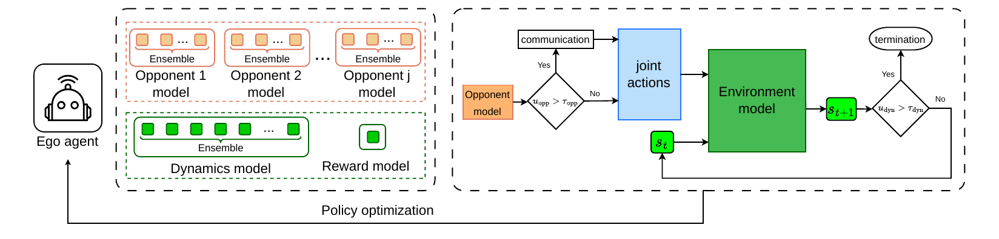

# Uncertainty-Aware AORPO

**Model-based Multi-Agent Reinforcement Learning via Uncertainty Quantification**

A JAX implementation of an uncertainty-aware extension of **Adaptive Opponent-wise Rollout Policy Optimization (AORPO)** for model-based multi-agent reinforcement learning.

The method uses uncertainty from learned opponent and dynamics models to decide **when communication is needed** and **how long model-based rollouts should continue**.

<p align="center">
  
</p>

## Highlights

- **Uncertainty-aware communication**  
  Opponent-model uncertainty is used to determine when communication with other agents is needed.

- **Adaptive model rollouts**  
  Dynamics-model uncertainty is used to terminate synthetic rollouts before model error becomes too large.

- **JAX reimplementation of AORPO**  
  A JAX implementation of the original AORPO baseline is preserved in the `aorpo_jax` branch.

- **Pretrained model and demo**  
  A pretrained checkpoint and demo scripts are included for testing learned policies and model-generated trajectories.

---

## Method Overview

The ego agent learns probabilistic ensemble models for both opponents and environment dynamics.

During model rollouts, opponent-model uncertainty is compared with a communication threshold. If the opponent prediction is sufficiently uncertain, communication is used instead.

Dynamics-model uncertainty is evaluated during each synthetic rollout and is used to adaptively terminate the rollout when model predictions become unreliable.

The resulting real and model-generated transitions are used for SAC-style policy optimization.

---

## Environments

Experiments were conducted on two JaxMARL environments:

| Environment | Description |
|---|---|
| `MPE_simple_spread_v3` | Cooperative navigation with 3 agents and 3 landmarks |
| `MPE_simple_facmac_3a_v1` | Cooperative multi-agent pursuit task |

The primary implementation in `main` corresponds to **Simple Spread**.

FACMAC is retained as an additional evaluation experiment.

---

## Branches

| Branch | Purpose |
|---|---|
| `main` | Final uncertainty-aware AORPO implementation for Simple Spread |
| `aorpo_jax` | JAX reimplementation of the original AORPO baseline |
| `aorpo_uq_facmac` | Uncertainty-aware AORPO evaluation on FACMAC |

To inspect the JAX AORPO baseline:

```bash
git switch aorpo_jax
```

To inspect the FACMAC experiment:

```bash
git switch aorpo_uq_facmac
```

---

## Installation

Clone the repository:

```bash
git clone https://github.com/AachenTian/uncertainty-aware-aorpo.git
cd uncertainty-aware-aorpo
```

Create a Python 3.10 environment:

```bash
conda create -n aorpo_jax python=3.10
conda activate aorpo_jax
```

Install the dependencies:

```bash
python -m pip install --upgrade pip
pip install -r requirements.txt
```

Install JaxMARL while preserving the tested JAX version:

```bash
pip install --no-deps "jaxmarl==0.1.0"
```

The main tested stack includes JAX 0.6.2, Flax 0.10.4, Optax 0.2.5, and JaxMARL 0.1.0.

> GPU users should install the JAX build appropriate for their CUDA environment.

For reference, the full development environment is recorded in `requirements-local-lock.txt`.

---

## Training

The main training entry point is:

```bash
python train.py
```

The default Simple Spread configuration is located at:

```text
aorpo/configs/train.yaml
```

The default setup uses 3 agents, 3 landmarks, a 25-step episode horizon, a dynamics ensemble of 10 models, and an opponent-policy ensemble of 5 models.

Hydra parameters can be overridden from the command line, for example:

```bash
python train.py seed=1 train.epochs=100 rollout.k=4
```

Training supports Weights & Biases logging. For offline logging:

```bash
WANDB_MODE=offline python train.py
```

---

## Demo

A pretrained checkpoint is provided at:

```text
checkpoints/final_execution_ckpt.pkl
```

Check that the checkpoint and learned models can be loaded correctly:

```bash
python -m demo.check_checkpoint
```

Run the real-environment vs. learned-dynamics comparison:

```bash
python -m demo.run_demo
```

Generated trajectories and animations are written to `demo_outputs/`.

---

## Results

### Reward vs. Training Steps

<p align="center">
  
</p>

### Reward vs. Communication

<p align="center">
  
</p>

Publication-quality PDF versions and additional experimental figures are available in `figures/`.

---

## Thesis

This repository accompanies the thesis:

> **Model-based Multi-agent Reinforcement Learning via Uncertainty Quantification**  
> Yachen Tian  
> RWTH Aachen University, 2026

[Read the thesis](paper/thesis.pdf)

The thesis investigates uncertainty quantification for learned opponent and environment models in model-based multi-agent reinforcement learning.

---

## Citation

If you use this implementation in academic work, please cite the accompanying thesis and the original AORPO work on which this project builds.

```bibtex
@misc{tian2026uncertainty,
  author = {Yachen Tian},
  title  = {Model-based Multi-agent Reinforcement Learning via Uncertainty Quantification},
  school = {RWTH Aachen University},
  year   = {2026}
}
```

---

## License

This project is distributed under the terms of the license provided in [`LICENSE`](LICENSE).
