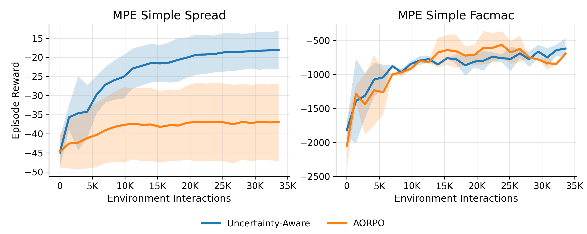
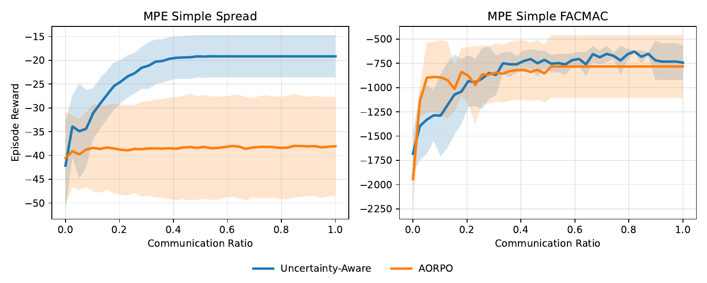

# Uncertainty-Aware AORPO

**Model-based Multi-Agent Reinforcement Learning via Uncertainty Quantification**

A JAX implementation of an uncertainty-aware extension of **Adaptive Opponent-wise Rollout Policy Optimization (AORPO)** for model-based multi-agent reinforcement learning.

The method explicitly models two sources of uncertainty during model-based rollouts:

* **Opponent-model uncertainty** determines when communication with other agents is required.
* **Dynamics-model uncertainty** controls adaptive model rollout lengths and prevents unreliable synthetic transitions from being used for policy learning.

The implementation is built with **JAX**, **Flax**, **Optax**, and **JaxMARL**.

---

## Overview

Model-based multi-agent reinforcement learning can improve sample efficiency by generating additional experience with learned environment models. However, model errors can accumulate quickly during long rollouts, while inaccurate opponent models may lead to incorrect assumptions about other agents' actions.

This project extends AORPO with uncertainty-aware mechanisms for both problems.

### Opponent uncertainty

Each opponent policy is represented by an ensemble of probabilistic neural networks.

The predictive uncertainty of the opponent model is used to determine whether the agent should rely on its learned opponent model or request communication.

High uncertainty therefore triggers communication only when it is expected to be useful.

### Dynamics uncertainty

The environment dynamics are represented using an ensemble of probabilistic neural networks.

Predictive uncertainty is accumulated during model rollouts and used to determine an adaptive rollout horizon.

This allows model-generated trajectories to continue while predictions remain reliable and terminate when uncertainty becomes too large.

### Policy optimization

Policy learning follows a Soft Actor-Critic-style actor-critic framework using both real environment transitions and model-generated transitions.

A simplified training flow is:

```text
Real environment interaction
          │
          ▼
     Replay buffer
          │
          ├──────────────► Opponent-model ensemble
          │                       │
          │                       ▼
          │              Opponent uncertainty
          │                       │
          │                 Communication
          │
          └──────────────► Dynamics ensemble
                                  │
                                  ▼
                         Dynamics uncertainty
                                  │
                                  ▼
                       Adaptive model rollout
                                  │
                                  ▼
                       Model replay buffer
                                  │
                                  ▼
                           SAC-style updates
```

---

## Environments

The project was evaluated on two JaxMARL environments:

| Environment               | Branch            | Description                                          |
| ------------------------- | ----------------- | ---------------------------------------------------- |
| `MPE_simple_spread_v3`    | `aorpo_uq_spread` | Cooperative navigation with 3 agents and 3 landmarks |
| `MPE_simple_facmac_3a_v1` | `aorpo_uq_facmac` | Cooperative multi-agent pursuit environment          |
| AORPO baseline            | `aorpo_jax`       | JAX reimplementation of the original AORPO baseline  |

This README describes the **`aorpo_uq_spread`** branch.

---

## Branches

The repository preserves the main stages of the project in separate branches:

| Branch            | Purpose                                   |
| ----------------- | ----------------------------------------- |
| `aorpo_jax`       | JAX implementation of the AORPO baseline  |
| `aorpo_uq_spread` | Uncertainty-aware AORPO for Simple Spread |
| `aorpo_uq_facmac` | Uncertainty-aware AORPO for FACMAC        |

To switch experiments:

```bash
```

or

```bash
git switch aorpo_uq_facmac
```

---

## Installation

### 1. Clone the repository

```bash
git clone https://github.com/AachenTian/uncertainty-aware-aorpo.git
cd uncertainty-aware-aorpo
```

### 2. Create a Python environment

For example, using Conda:

```bash
conda create -n aorpo_jax python=3.10
conda activate aorpo_jax
```

### 3. Install project dependencies

```bash
python -m pip install --upgrade pip
pip install -r requirements.txt
```

The experiments were developed with:

```text
Python 3.10
JAX 0.6.2
Flax 0.10.4
Optax 0.2.5
JaxMARL 0.1.0
```

### 4. Install JaxMARL

The project uses JAX 0.6.2, while the dependency metadata of JaxMARL 0.1.0 may enforce an older JAX version.

To preserve the tested JAX installation:

```bash
pip install --no-deps "jaxmarl==0.1.0"
```

> **GPU users:** install the appropriate GPU-enabled JAX build for your CUDA environment. The exact JAX installation command depends on the CUDA and driver versions of the machine.

A complete snapshot of the development environment is also provided in:

```text
requirements-local-lock.txt
```

This file is mainly intended for reproducibility rather than as the default installation method.

---

## Training

The main training entry point is:

```text
train.py
```

Start training with:

```bash
python train.py
```

The experiment configuration is stored in:

```text
aorpo/configs/train.yaml
```

### Weights & Biases

Training uses Weights & Biases for experiment tracking.

Log in before running:

```bash
wandb login
```

The W&B project and entity can optionally be specified through environment variables:

```bash
WANDB_PROJECT=my-aorpo-project \
WANDB_ENTITY=my-account \
python train.py
```

If no project name is provided, the default project is:

```text
AORPO-dynamics-model
```

For offline logging:

```bash
WANDB_MODE=offline python train.py
```

---

## Main Simple Spread Configuration

The default configuration in `aorpo/configs/train.yaml` uses:

| Parameter                      |                  Value |
| ------------------------------ | ---------------------: |
| Environment                    | `MPE_simple_spread_v3` |
| Agents                         |                      3 |
| Landmarks                      |                      3 |
| Episode horizon                |                     25 |
| Training epochs                |                    200 |
| Real environment steps / epoch |                    300 |
| Training batch size            |                   1024 |
| Maximum model rollout horizon  |                      6 |
| Dynamics ensemble size         |                     10 |
| Opponent ensemble size         |                      5 |
| Dynamics learning rate         |                 `3e-4` |
| Policy learning rate           |                 `1e-2` |
| Discount factor                |                 `0.95` |
| SAC temperature                |                  `0.2` |

Uncertainty-related rollout parameters can also be modified in:

```yaml
rollout:
  batch_size: 1024
  k: 6
  quantile_opp: 0.99
  zeta1: 0.99
  zeta2: 0.01
  xi: 30.0
```

Hydra parameters can be overridden directly from the command line. For example:

```bash
python train.py seed=1 train.epochs=100 rollout.k=4
```

---

## Pretrained Checkpoint

A pretrained execution checkpoint is included:

```text
checkpoints/final_execution_ckpt.pkl
```

The checkpoint contains the parameters required for execution and model evaluation, including:

* dynamics-model parameters;
* reward-model parameters;
* ego-policy parameters;
* real opponent-policy parameters;
* normalization statistics;
* training configuration and model dimensions.

Optimizer states and Q-function training states are intentionally not included.

---

## Demo

Two utilities are provided under `demo/`.

### Check the pretrained checkpoint

```bash
python -m demo.check_checkpoint
```

This reconstructs the networks from the checkpoint and verifies:

* ego-policy inference;
* opponent-policy inference;
* dynamics-model inference;
* reward-model inference.

A successful run should begin with:

```text
Checkpoint loaded successfully.
```

### Compare real and model trajectories

Run:

```bash
python -m demo.run_demo
```

The script executes both a real environment trajectory and a learned dynamics-model trajectory.

Generated outputs are written to:

```text
demo_outputs/
```

including:

```text
real_env_traj.npz
dynamics_model_traj.npz
real_vs_dynamics.mp4
```

`demo_outputs/` is generated locally and is not tracked by Git.

> Run the demo using `python -m demo.run_demo` rather than `python demo/run_demo.py` so that the repository root is correctly included in Python's module search path.

---

## Results

### Reward vs. Training Steps



### Reward vs. Communication



Additional result figures are available under:

```text
figures/
```

including:

* `selected_runs_plot.png`
* `reward_vs_steps.pdf`
* `reward_vs_comm.pdf`
* `ablation_spread.pdf`

The corresponding processed experiment data are stored under:

```text
results/
```

---

## Reproducing Figures

Plotting and W&B data-export utilities are organized under `scripts/`.

```text
scripts/
├── export_wandb_spread.py
├── plot_ablation_spread.py
├── plot_reward_vs_communication.py
├── plot_reward_vs_steps.py
└── plot_wandb_curves.py
```

For example:

```bash
python scripts/plot_reward_vs_steps.py
```

or:

```bash
python scripts/plot_reward_vs_communication.py
```

Processed experiment data used by the plotting utilities are available in:

```text
results/
├── mpe_simple_spread.csv
└── mpe_simple_tag.csv
```

---

## Repository Structure

```text
.
├── aorpo/
│   ├── agents/
│   │   ├── model_dynamics.py
│   │   ├── opponent_policy.py
│   │   ├── policy.py
│   │   ├── q_function.py
│   │   ├── update_opponents_model.py
│   │   ├── update_policy.py
│   │   └── update_q_function.py
│   │
│   ├── configs/
│   │   ├── agents/
│   │   └── train.yaml
│   │
│   ├── envs/
│   │   └── jaxmarl_simple_spread_v3_env_wrapper.py
│   │
│   ├── rollout/
│   │   ├── collect.py
│   │   ├── rollout.py
│   │   └── uncertainty_threshold.py
│   │
│   ├── utils/
│   │   ├── export_checkpoint.py
│   │   └── replay.py
│   │
│   └── visualization/
│       └── make_animation.py
│
├── checkpoints/
│   └── final_execution_ckpt.pkl
│
├── demo/
│   ├── __init__.py
│   ├── check_checkpoint.py
│   └── run_demo.py
│
├── figures/
│   └── ...
│
├── results/
│   └── ...
│
├── scripts/
│   └── ...
│
├── train.py
├── requirements.txt
├── requirements-local-lock.txt
├── LICENSE
└── README.md
```

---

## Method Components

The main implementation is organized around the following components.

### Probabilistic dynamics ensemble

`aorpo/agents/model_dynamics.py`

Learns probabilistic environment dynamics using an ensemble of neural networks and provides predictive uncertainty estimates for model rollouts.

### Opponent-policy ensemble

`aorpo/agents/opponent_policy.py`

Models other agents' policies probabilistically. Ensemble uncertainty is used by the communication mechanism.

### Uncertainty-aware rollout

`aorpo/rollout/rollout.py`

Generates synthetic experience using the learned models while adapting rollout lengths according to dynamics uncertainty.

### Uncertainty thresholds

`aorpo/rollout/uncertainty_threshold.py`

Implements uncertainty-based decision rules used by communication and model rollout control.

### Policy and value learning

```text
aorpo/agents/policy.py
aorpo/agents/q_function.py
aorpo/agents/update_policy.py
aorpo/agents/update_q_function.py
```

Implements the actor-critic components used to optimize the agents from real and model-generated experience.

---

## Thesis

This repository accompanies the thesis:

> **Model-based Multi-agent Reinforcement Learning via Uncertainty Quantification**
> Yachen Tian, RWTH Aachen University, 2026.

The thesis investigates uncertainty quantification as a mechanism for improving the reliability of learned opponent and environment models in model-based multi-agent reinforcement learning.

The proposed method was evaluated on **Simple Spread** and **FACMAC**, showing improved performance on Simple Spread and comparable performance to AORPO on FACMAC.

---

## Citation

If you use this implementation in academic work, please cite the accompanying thesis and the original AORPO work on which this implementation is based.

```bibtex
@mastersthesis{tian2026uncertainty,
  author = {Yachen Tian},
  title  = {Model-based Multi-agent Reinforcement Learning via Uncertainty Quantification},
  school = {RWTH Aachen University},
  year   = {2026}
}
```

---

## License

This project is distributed under the terms of the license provided in [`LICENSE`](LICENSE).
